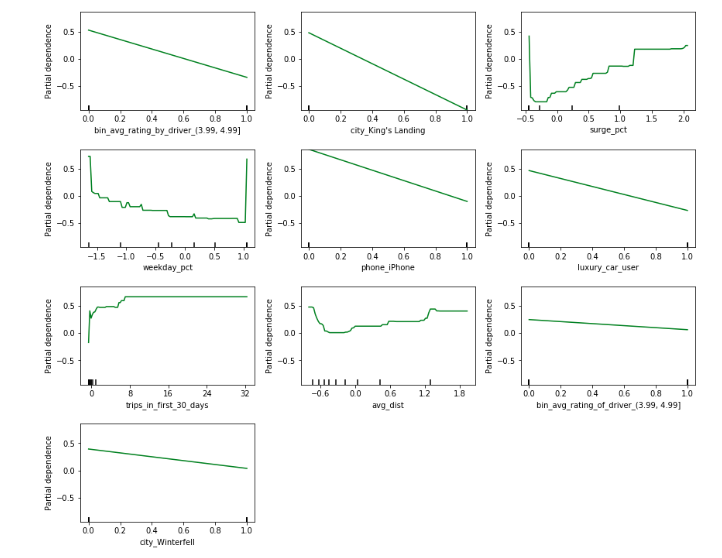

Please note: Data was provided by a Ride Share company that wishes to remain anonymous. Our program was not asked to share the data, and therefore it has been left out of this repository.


```python
import numpy as np
import pandas as pd
from sklearn.model_selection import cross_val_score
from matplotlib import pyplot as plt
%matplotlib inline
import model as fxns
from pandas.plotting import scatter_matrix
import scipy as sp

from sklearn.model_selection import train_test_split
from sklearn.ensemble import GradientBoostingClassifier
from sklearn.ensemble import RandomForestClassifier
from sklearn import metrics 

#pd.set_option('display.max_rows', 500)
pd.set_option('display.max_columns', 500)
pd.set_option('display.width', 1000)
```

```python
df = pd.read_csv('data/churn.csv')
```

# Cleaning

```python
df.info()
```

### Clean driver ratings


Average rating of driver has ~ 1/5 of dating missing. This is a huge problem going forward, we don't want to just drop 1/5 of our dataset

```python
df.avg_rating_of_driver.hist()
```


As shown above, the distribution is shifted towards 5.0. In this case, where our data is skewed, median is a better representation of the data than the mean. We don't want to just fill Null values with the mode, because then we would be assigning a perfect rating to ~1/5 of our dataset. 

Before we go ahead and replace the null values, lets see if 'no rating of driver' could be its own informative feature

```python
df['no_rating_of_driver'] = pd.isnull(df.avg_rating_of_driver)*1
```

```python
val1 = (df['no_rating_of_driver']==1)
val2 = (df['no_rating_of_driver']==0)
sp.stats.ttest_ind(val1, val2)
```

The significant difference indicates that 'no_rating_of_driver' is informative


## Bin by rating

```python
fig, (ax1, ax2) = plt.subplots(1,2, figsize=(10,5))

ax1 = df.avg_rating_by_driver.hist(bins=50, ax=ax1)
ax1.set_title('rating_by_driver')
ax2 = df.avg_rating_of_driver.hist(bins=50, ax=ax2)
ax2.set_title('rating_of_driver')
```


It seems like many users give a 5 star rating by default, and not many give below a 4 star rating. A 4 star rating might be skewed, when users dont rate drivers more poorly due to convenience (i.e. being asked more about their experience). 

```python
df['rating_5'] = df.avg_rating_of_driver == 5
```

We are also going to bin our original average rating of/by driver columns

```python
df['bin_avg_rating_by_driver'] = pd.cut(df.avg_rating_by_driver, bins=[0., 2.99, 3.99, 4.99, 5], 
                                        include_lowest=True, right=True)
df['bin_avg_rating_of_driver'] = pd.cut(df.avg_rating_of_driver, bins=[0., 2.99, 3.99, 4.99, 5], 
                                        include_lowest=True, right=True)

df.bin_avg_rating_by_driver.cat.add_categories('missing', inplace=True)
df.bin_avg_rating_of_driver.cat.add_categories('missing', inplace=True)

df.bin_avg_rating_by_driver.fillna('missing', inplace=True)
df.bin_avg_rating_of_driver.fillna('missing', inplace=True)
```

Great, now we have a categorical representation of our driver ratings


## Clean phone column

```python
# Filling missing values with no phone, 
# as null values can still be informative
df.phone = df.phone.fillna('no_phone')
```

### Cleaning Continued...


Our dataset is now relatively clean. To keep things simple, the rest of the code for cleaning is in model.py. Categorical columns were dummied, dropping one of the categories, and numerical data was scaled using standard scaler

```python
df = pd.read_csv('data/churn.csv')
```

```python
import model as fxns
clean = fxns.Cleaning()
clean.fit(df)
df = clean.all(scale=True)
```

# EDA

```python
core_features = ['avg_dist', 'avg_surge', 'surge_pct', 
                 'trips_in_first_30_days', 'luxury_car_user', 'weekday_pct']
colors = ['red' if ix else 'blue' for ix in df.churn]
```

```python
scat = scatter_matrix(df[core_features], 
               alpha=0.2, figsize=(16, 16), 
               diagonal='hist', color=colors)
```


# Build Model

```python
df = pd.read_csv('data/churn.csv')
import model as fxns
clean = fxns.Cleaning()
clean.fit(df)
df = clean.all(scale=True)
df = clean.drop_dt()
```

```python
y = df.churn.values
X = df.drop('churn', axis=1).values
```

```python
X_train, X_test, y_train, y_test = train_test_split(X,y, test_size=0.2)
```

```python
rf = GradientBoostingClassifier()
gb = RandomForestClassifier()
```

### Random Forest Model

```python
rf.fit(X_train, y_train)
rf.score(X_test, y_test)
```


Going to now run CV to get a better idea of score

```python
mod = fxns.Model()
mod.fit(df)
cv_score_rf = np.mean(mod.CV(rf.fit(X_train, y_train)))

print('Random Forest CV accuracy (10-Fold): {}'.format(cv_score_rf))
```


```python
y_hat = rf.predict(X_test)

##Evaluating Model Performance
#Import scikit-learn metrics module for accuracy calculation
from sklearn import metrics
# Model Accuracy, how often is the classifier correct?
print("Precision:",metrics.precision_score(y_test, y_hat))
# Model Recall
print("Recall:",metrics.recall_score(y_test, y_hat))
```


### Gradient Boosting Model

```python
gb.fit(X_train, y_train)
gb.score(X_test, y_test)
```


Going to now run CV to get a better idea of score

```python
cv_score_gb = np.mean(mod.CV(gb.fit(X_train, y_train)))
print('GB accuracy (10-Fold): {}'.format(cv_score_gb))
```


```python
y_hat = gb.predict(X_test)

##Evaluating Model Performance
#Import scikit-learn metrics module for accuracy calculation
from sklearn import metrics
# Model Precision
print("Precision:",metrics.precision_score(y_test, y_hat))
# Model Recall
print("Recall:",metrics.recall_score(y_test, y_hat))
```


## Roc Curve

```python
from sklearn.metrics import roc_curve
```

```python
fpr, tpr, thresholds = roc_curve(
    y_test, gb.predict_proba(X_test)[:,1])

fpr_rf, tpr_rf, thresholds_rf = roc_curve(
    y_test, rf.predict_proba(X_test)[:,1])
```

```python
fig, ax = plt.subplots(1,1, figsize=(8,5))

ax.plot(fpr, tpr, lw=2, alpha=1,label='Gradient Boosting Model')
ax.plot(fpr_rf, tpr_rf, lw=2, alpha=1,label='Random Forest Model')

ax.set_title('ROC Curve')
ax.set_xlabel('False Positive Rate')
ax.set_ylabel('True Positive Rate')
ax.legend()
plt.show()
```


```python
import sklearn.metrics as skm
skm.roc_auc_score(y_test, rf.predict(X_test))
```


```python
import sklearn.metrics as skm
skm.roc_auc_score(y_test, gb.predict(X_test))
```


## Confusion Matrices

```python
from sklearn.metrics import confusion_matrix

fxns.plot_confusion_matrix(y_test, gb.predict(X_test))
fxns.plot_confusion_matrix(y_test, rf.predict(X_test))
```


## Feature Importances

```python
mod.importance(rf.fit(X_train, y_train))
```


```python
mod.plot_partial_dependencies(rf)
```


# Grid Searching

```python
from sklearn.model_selection import GridSearchCV
```

### Gradient Boosting

```python
gb_grid = {
    'learning_rate': [1.0, 0.5, 0.01],
    'max_depth': [1, 3, 8],
    'min_samples_leaf': [3],
    'max_features': ['sqrt', 'log2', None ],
    'n_estimators': [500, 1000],
    'subsample': [0.5, 0.75, 1.0]
}
gb_grid_cv = GridSearchCV(GradientBoostingClassifier(), 
                           gb_grid, n_jobs=-1, cv=3,
                         scoring='roc_auc')
```

```python
gb_grid_cv.fit(X_train, y_train)
```

```python
best_gb_model = gb_grid_cv.best_estimator_
best_gb_params = gb_grid_cv.best_params_
best_gb_params
```


```python
gb_grid_cv.best_score_
```


#### Plot Loss

```python
fxns.plot_loss(best_gb_model, best_gb_params, X_test, y_test)
```


### Random Forest

```python
rf_grid = {
    'max_depth': [4, 8, None],
    'max_features': ['sqrt', 'log2', None],
    'min_samples_split': [2, 4],
    'min_samples_leaf': [1, 2, 4],
    'bootstrap': [True], # Mandatory with oob_score=True
    'n_estimators': [50, 100, 200, 400],
    'random_state': [67],
    'oob_score': [True],
    'n_jobs': [-1]
    }
rf_grid_cv = GridSearchCV(RandomForestClassifier(),
                             rf_grid, cv=3,
                             n_jobs=-1,
                             verbose=True,
                             scoring='roc_auc')
```
```python
rf_grid_cv.fit(X_train, y_train)
```

```python
best_rf_params = rf_grid_cv.best_params_
best_rf_params
```


```python
best_rf_model = rf_grid_cv.best_estimator_
rf_grid_cv.best_score_
```


# Choosing a model


Since our data is slightly unbalanced, ROC AUC score is a better evaluator than accuracy. The Gradient Boosting Model marginally outperformed Random Forest, and by nature it is better equipped to handle unbalanced data, so we are using it going forward


# Partial Dependence with unscaled data

```python
df = pd.read_csv('data/churn.csv')
import model as fxns
clean = fxns.Cleaning()
clean.fit(df)
df = clean.all(scale=False)
df = clean.drop_dt()
```

```python
y = df.churn.values
X = df.drop('churn', axis=1).values
X_train, X_test, y_train, y_test = train_test_split(X,y, test_size=0.2)

mod = fxns.Model()
mod.fit(df)
np.mean(mod.CV(best_gb_model))
```


```python
fxns.plot_confusion_matrix(y_test, best_gb_model.predict(X_test))
```


```python
mod.plot_partial_dependencies(best_gb_model)
```


The following should be monitored due to increased risk of churn:
    - Average rating by driver less than 5.0
    - Greater than 35% surge pct 
    - Be more worried about android users, consider making a better 
        application for android phones

Certain cities should also be looked at. King's landing has a drastically reduced chance of churn
